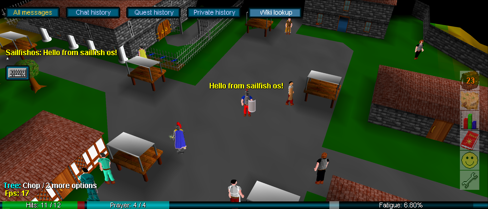

# sailfish-rsc-c

RuneScape Classic is the original 2001-era RuneScape MMORPG. This project is an
open-source RuneScape Classic client port for Sailfish OS. Create your account
at [https://rsc.vet](https://rsc.vet).

[](./sailfish-media/gameplay.mp4)

Click the screenshot to play a gameplay video.

> [!WARNING]  
> This port was created with heavy utilization of OpenAI Codex.


## Downloads
You can install the game either from GitHub Releases or from Chum.

- [GitHub Releases (prebuilt packages)](https://github.com/miikasda/sailfish-rsc-c/releases)
- [SailfishOS:Chum app page](https://sailfishos-chum.github.io/apps/rsc-c/)


## Known issues
- While logging in, the login text flickers / changes rapidly
- Wiki lookup does not work when sailjail is enabled


## Build instructions
Release build:

```bash
sfdk build
```

Optional full rebuild:

```bash
sfdk build -- --define "clean_build 1"
```

Optional debug build:

```bash
sfdk build -- --define "debug_build 1"
```

Optional full rebuild + debug:

```bash
sfdk build -- --define "clean_build 1" --define "debug_build 1"
```
